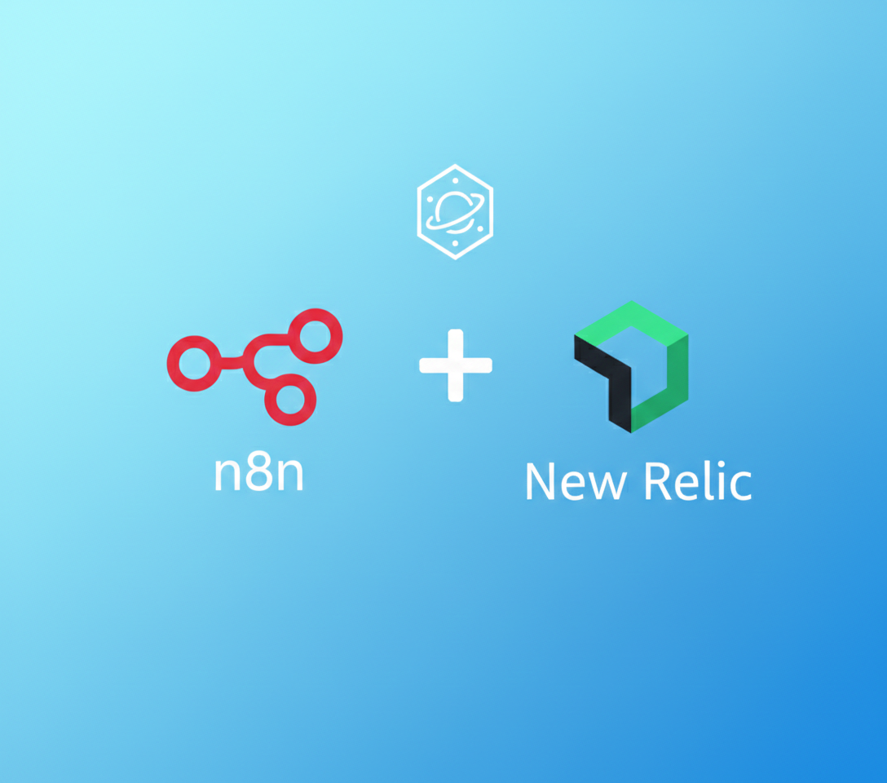

# n8n-nodes-newrelic


This is an n8n community node. It lets you use New Relic in your n8n workflows.

n8n is a [fair-code licensed](https://docs.n8n.io/reference/license/) workflow automation platform.

[Installation](#installation)  
[Operations](#operations)  
[Credentials](#credentials)  
[Usage](#usage)  
[Development](#development)

## Installation

Follow the [installation guide](https://docs.n8n.io/integrations/community-nodes/installation/) in the n8n community nodes documentation to install this node.

If you want to install this node locally for development:

1.  Clone this repository.
2.  Run `npm install` in the `n8n-nodes-newrelic` directory.
3.  Run `npm run build` to build the code.
4.  Link the node to your n8n installation:
    ```bash
    cd n8n-nodes-newrelic
    npm link
    cd /path/to/n8n/root
    npm link n8n-nodes-newrelic
    ```
    (Or usually for n8n local development, you just need to `npm link` inside the node folder and then start n8n, ensuring n8n looks for custom nodes in the global `node_modules` or `~/.n8n/custom`).

## Operations

### Account
*   **Get Consumption**: Retrieve usage data (e.g., GB consumed per metric type).
*   **Get Account Structure**: Retrieve the parent-child account hierarchy.

### Entity
*   **Search Catalog**: Search the New Relic entity catalog (e.g., by domain, name, or tags).
*   **Get Relationships**: Retrieve related entities (dependencies) for a specific entity.
*   **Get Tags**: Retrieve tags assigned to a specific entity.
*   **Get Golden Metrics**: Retrieve golden metrics for a specific entity.

### User Management
*   **Get Authentication Domains**: Retrieve the IDs and details of authentication domains in the organization.
*   **Create User**: Create a new user in a specific authentication domain (Basic, Core, or Full). Note: Not recommended for domains using SCIM provisioning.

### NRQL Execution
*   **Query**: Execute a NRQL (New Relic Query Language) query via NerdGraph.

### Trigger
*   **New Relic Trigger**: Receive real-time alerts from New Relic via Webhook. Supports security verification using a Secret Token.


## Credentials

To use this node, you need to set up credentials:

1.  **User API Key**: You need a **User API Key** (starts with `NRAK-`).
    *   Go to New Relic API keys documentation: [User API Key](https://docs.newrelic.com/docs/apis/intro-apis/new-relic-api-keys/#user-api-key).
2.  **Region**: Select your New Relic data region:
    *   **US** (United States)
    *   **EU** (Europe)
3.  **New Relic Secret** (for Trigger): Create a new credential and enter your **Secret Token** to verify webhook signatures.

## Usage

### Automating Incident Enrichment (Example)
1.  Add the **New Relic Trigger** node to receive webhook alerts.
2.  Add the **New Relic** node to your workflow.
3.  Select **Entity** as the Resource and **Search Catalog** or **Get Relationships** to gather context about the failing service.
4.  Chain this data to a Jira or Slack node to automate ticket creation with enriched context.

### Execute NRQL
1.  Add the **New Relic** node to your workflow.
2.  Select **NRQL** as the Resource and **Execute** as the Operation.
3.  Enter your NRQL command in the **NRQL** field.
    *   Example: `SELECT count(*) FROM Transaction`
4.  Execute the node. The result will return the raw data from NerdGraph.

## Development

1.  Install dependencies:
    ```bash
    cd n8n-nodes-newrelic
    npm install
    ```
2.  Build the code:
    ```bash
    npm run build
    ```
3.  Watch for changes (optional):
    ```bash
    npm run build:watch
    ```

## Resources

*   [n8n community nodes documentation](https://docs.n8n.io/integrations/creating-nodes/)
*   [New Relic NerdGraph GraphiQL Explorer](https://api.newrelic.com/graphiql)
